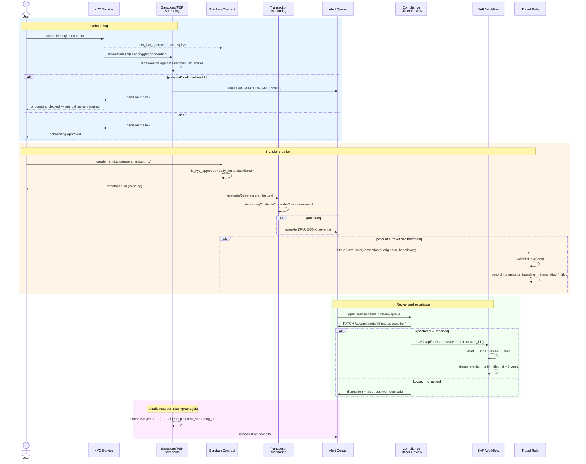

# SwiftRemit — AML/CTF Compliance Control Inventory

**SR-112 | Last updated:** 2026-07-30  
**Owner:** Compliance / Engineering  
**Review cadence:** Quarterly or after any regulatory guidance change

> **Disclaimer:** This document is an internal technical control inventory. It
> is not legal advice. Jurisdiction-specific legal review is required before
> operating in any of the markets listed below.

---

## 1. Regulatory Scope

| Jurisdiction | Regulation | Obligation | Threshold | Status |
|---|---|---|---|---|
| USA | FinCEN BSA (31 U.S.C. §5311 et seq.) | KYC / CDD, SAR filing, 5-year record retention | SAR ≥ $5,000; CTR ≥ $10,000 | **Implemented** |
| USA | OFAC (31 C.F.R. Parts 500–599) | Sanctions screening at onboarding + ongoing periodic rescreen | No de minimis — all transactions | **Implemented** |
| USA | FinCEN Travel Rule (31 C.F.R. §103.33) | Transmit originator/beneficiary data with transfer; collect ≥ $1,000 | Transmission ≥ $3,000; collection ≥ $1,000 | **Implemented** |
| EU | AMLD6 / MiCA / DORA | KYC, transaction monitoring, travel rule per FATF | Travel rule: no de minimis for CASP transfers | **Partial** — EU-specific product disclosure and DPO appointment not yet scoped |
| FATF | Recommendation 16 (Travel Rule) | VASP-to-VASP originator + beneficiary data transmission | ≥ $1,000 / €1,000 | **Implemented** |
| General (all jurisdictions) | FATF Recommendations 12 & 13 | PEP screening, adverse media monitoring | Enhanced due diligence for PEPs | **Implemented** |
| General (all jurisdictions) | BSA §5324 / FATF Rec. 1 | Structuring detection (smurfing) | Transactions designed to evade reporting thresholds | **Implemented** |

### Known gaps

| Gap | Jurisdiction | Impact | Remediation target |
|---|---|---|---|
| EU-specific product disclosures (MiCA Art. 66) | EU | Required before EU market entry | Pre-EU launch |
| DPO appointment / GDPR Art. 37 | EU | Required before processing EU personal data at scale | Pre-EU launch |
| Real-time VASP counterparty lookup (Notabene / Sygna) | FATF / USA | Travel rule transmission is a stub — no live VASP directory integration | Q3 2026 |
| FinCEN BSA E-Filing API integration | USA | SAR filing is stub — manual upload required | Q3 2026 |

---

## 2. Control Inventory

| Obligation | Control | Location | Completeness | Gap Reference |
|---|---|---|---|---|
| KYC at onboarding | `set_kyc_approved` (contract) + `kyc-service.ts` backend | `src/lib.rs` / `backend/src/kyc-service.ts` | **Full** | — |
| KYC expiry enforcement | `KycExpired` error (code 23) enforced in `create_remittance` + `kyc-expiry-notifier.ts` renewal flow | `src/errors.rs` / `backend/src/kyc-expiry-notifier.ts` | **Full** | — |
| Sanctions screening (OFAC, EU, UN, UK) | `SanctionsScreeningService` — fuzzy name matching against `sanctions_list_entries`, persists run to `sanctions_screening_results`, raises alert on potential/confirmed match | `backend/src/aml/sanctions-screening.ts` | **Full** | List-ingest job must be wired to live provider feeds in production |
| PEP screening | Same `SanctionsScreeningService` — `entry_type = 'pep'` rows in the shared list table; same matching pipeline | `backend/src/aml/sanctions-screening.ts` | **Full** | PEP list ingest stub — production must connect a PEP data provider |
| Daily transaction send limits | `set_daily_limit` / `get_daily_limit_status` enforced in contract `create_remittance` | `src/lib.rs` (rate_limit.rs) | **Full** | — |
| Velocity monitoring (amount) | `RULE-002` (`velocityAmountRule`) — rolling 24 h cumulative send | `backend/src/aml/transaction-monitoring.ts` | **Full** | — |
| Velocity monitoring (count) | `RULE-003` (`velocityCountRule`) — rolling 1 h transfer count | `backend/src/aml/transaction-monitoring.ts` | **Full** | — |
| Structuring detection (just-below-threshold pattern) | `RULE-001` (`structuringRule`) — multiple transfers each below reporting threshold | `backend/src/aml/transaction-monitoring.ts` | **Full** | — |
| Round-amount repetition | `RULE-004` (`roundAmountRepetitionRule`) — repeated round-figure transfers in 24 h | `backend/src/aml/transaction-monitoring.ts` | **Full** | — |
| Unusual corridor detection | `RULE-005` (`unusualCorridorRule`) — first use of a previously unseen country corridor | `backend/src/aml/transaction-monitoring.ts` | **Full** | — |
| FATF Travel Rule data collection & transmission | `TravelRuleService` — threshold lookup, originator/beneficiary validation, payload hash, transmission record with retry | `backend/src/aml/travel-rule.ts` | **Full (stub transmission)** | Live VASP directory integration pending (see gap table) |
| SAR workflow | `SarWorkflowService` — draft → under_review → filed → acknowledged lifecycle, mandatory narrative length, retention stamping | `backend/src/aml/sar-workflow.ts` | **Full (stub filing)** | BSA E-Filing API integration pending |
| Data retention enforcement | `RetentionService` — per-entity cutoff enforcement, guarded deletes/anonymisations, run log | `backend/src/aml/retention.ts` | **Full** | — |
| Agent KYC | `register_agent(agent, kyc_hash?)` contract function + `agent-kyc-service.ts` | `src/lib.rs` / `backend/src/agent-kyc-service.ts` | **Full** | — |
| User blacklist | `blacklist_user` / `is_user_blacklisted` enforced in contract at `create_remittance` | `src/lib.rs` | **Full** | — |
| Alert review queue | `GET/PATCH /api/aml/alerts` — list, filter, assign, dispose with mandatory officer identity | `backend/src/routes/aml.ts` | **Full** | — |
| Compliance audit report | `GET /api/compliance/report` — filtered remittance export in JSON or CSV with audit trail | `backend/src/routes/compliance.ts` | **Full** | — |

---

## 3. AML/CTF Data Flow



---

## 4. Retention Schedule

| Data Type | Retention Period | Storage Location | Auto-Delete Mechanism |
|---|---|---|---|
| KYC records | 5 years after last transaction (BSA §103.121) | PostgreSQL `kyc_records` | `retention.ts` scheduled job (`entity = 'kyc_records'`, `action = 'anonymize'`) |
| Transaction / remittance records | 5 years (BSA §103.33(f)) | PostgreSQL `remittances` | `retention.ts` scheduled job (`entity = 'remittances'`, `action = 'anonymize'`) |
| SAR records | 5 years after filing date (BSA §103.18(d)) | PostgreSQL `sar_reports` + `sar_report_events` | **No auto-delete** — manual review only; `retention.ts` enforces only after `filed_at + retention_days` and only when status is `acknowledged` or `withdrawn` |
| Sanctions / PEP screening logs | 3 years | PostgreSQL `sanctions_screening_results` | `retention.ts` scheduled job (`entity = 'sanctions_screening_results'`, cutoff = `screened_at`); guarded against rows linked to open alerts |
| AML alert records | 5 years (BSA / AMLD6) | PostgreSQL `aml_alerts` | `retention.ts` scheduled job (`entity = 'aml_alerts'`); guarded against open/in_review/escalated alerts and alerts linked to any SAR |
| Travel rule records | 5 years | PostgreSQL `travel_rule_records` | `retention.ts` scheduled job (`entity = 'travel_rule_records'`) |
| Webhook delivery logs | 90 days | PostgreSQL `webhook_deliveries` | Existing webhook cleanup job (separate from AML retention) |
| Compliance report audit trail | 5 years | PostgreSQL `compliance_report_audit` | `retention.ts` (linked to transaction retention cycle) |

### Running the retention enforcer

```bash
# One-shot (dry-run): preview what would be deleted
cd backend
npx ts-node -e "
  import { Pool } from 'pg';
  import { RetentionService } from './src/aml/retention';
  const db = new Pool({ connectionString: process.env.DATABASE_URL });
  const svc = new RetentionService(db);
  svc.enforceAll().then(results => { console.table(results); db.end(); });
"

# In production the scheduler calls RetentionService.enforceAll() nightly.
```

---

## 5. Jurisdiction Coverage

### Supported / in-scope

| Jurisdiction | Entry point | Requirements met | Outstanding |
|---|---|---|---|
| **United States** | FinCEN / OFAC | KYC, OFAC sanctions, BSA travel rule ($3k transmit / $1k collect), SAR workflow, 5-year retention | BSA E-Filing API stub only — manual FinCEN upload required until Q3 2026 |
| **EU member states** | AMLD6 / MiCA | KYC, transaction monitoring, FATF travel rule (no de minimis for CASPs) | MiCA Art. 66 product disclosures and DPO appointment not yet completed |
| **FATF member states** | FATF 40 Recommendations | PEP screening (Rec. 12), travel rule (Rec. 16), transaction monitoring (Rec. 10) | Counterparty VASP directory lookup is stub — live integration required before correspondent VASP flows go live |

### Not yet in scope

- China (PBOC/CBIRC): requires separate licensing and data-localisation analysis.
- India (PMLA): separate RBI/FIU-IND requirements not yet assessed.
- Any jurisdiction where USDC is not a legally recognised instrument.

> **Legal sign-off required before launch in any jurisdiction.** This inventory is
> an engineering artefact, not a legal opinion.

---

## 6. Testing and Verification

### Running the AML/CTF test suite

```bash
cd backend
npx vitest run src/__tests__/aml.test.ts
```

For verbose output (show each test case):

```bash
cd backend
npx vitest run src/__tests__/aml.test.ts --reporter=verbose
```

### What is covered

| Test group | File | Controls exercised |
|---|---|---|
| Sanctions / PEP screening | `src/__tests__/aml.test.ts` | Name normalisation, edit distance, similarity scoring, outcome decisioning, alert raising, rescreen cadence |
| Transaction monitoring | `src/__tests__/aml.test.ts` | Structuring (RULE-001), velocity amount (RULE-002), velocity count (RULE-003), round-amount repetition (RULE-004), unusual corridor (RULE-005), `widestLookbackHours`, `windowBucket` |
| Alert queue | `src/__tests__/aml.test.ts` | Deduplication on `dedupe_key`, transition enforcement, mandatory narrative requirement, `buildAlertQuery` |
| SAR workflow | `src/__tests__/aml.test.ts` | Escalation gate, lifecycle transitions, retention stamping, narrative minimum length, `formatSarReference` |
| Travel rule | `src/__tests__/aml.test.ts` | Threshold resolution, `validateDataSets` completeness, `payloadHash` determinism, transmission recording |
| Retention | `src/__tests__/aml.test.ts` | Cutoff arithmetic, `ENTITY_PLANS` guard predicates, run logging |
| Type utilities | `src/__tests__/aml.test.ts` | `isAlertTransitionAllowed` state machine |

### CI integration

The AML test suite runs in `contract-ci.yml` as part of the backend test job. A
failing test blocks merge to `main`.

---

## 7. Change Control

All changes to AML/CTF controls must:

1. Reference the SR-112 issue (or successor) in the PR description.
2. Include updated tests in `src/__tests__/aml.test.ts`.
3. Have this document updated to reflect any new controls, gaps closed, or scope changes.
4. Be reviewed by the Compliance Officer before merge when the change affects:
   - A threshold value (reporting, travel rule, velocity)
   - The retention schedule
   - The SAR lifecycle
   - Sanctions list ingest configuration
