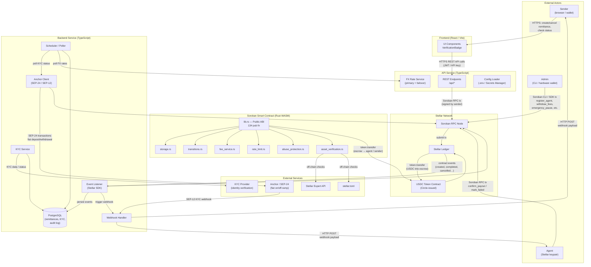

# SwiftRemit Threat Model

<!-- SR-110 -->

## 1. Document Metadata

| Field | Value |
|---|---|
| **Document ID** | SR-110 |
| **Version** | 1.0 |
| **Date** | 2026-07-30 |
| **Status** | DRAFT |
| **Authors** | Security Engineering |
| **Review Cadence** | Per release (reviewed and updated before each production deployment) |
| **Next Review** | Before next production release |
| **Classification** | Internal — Confidential |

---

## 2. System Overview

SwiftRemit is a production-grade escrow-based cross-border remittance platform built on the Stellar blockchain. Senders deposit USDC stablecoins into a Soroban smart contract escrow; registered agents handle the fiat payout to the recipient off-chain, then call back into the contract to confirm settlement and unlock their USDC payment (net of platform fees).

**Key characteristics relevant to threat modelling:**

- All financial settlement logic lives on-chain in a single Soroban WASM contract (`lib.rs`).
- A TypeScript backend listens to contract events via the Stellar SDK and drives off-chain flows: KYC checks, anchor (SEP-24) interactions, webhooks, and PostgreSQL persistence.
- A TypeScript API service exposes REST endpoints consumed by the React/Vite frontend and potentially third-party integrators.
- Agents are externally-controlled Stellar keypairs that hold the `Settler` role; they are the primary off-chain trusted party.
- Admin operations that have broad financial impact (fee changes, fee withdrawal, pause/unpause) are protected by an M-of-N multisig flow.
- Several contract functions are deliberately permissionless (e.g. `process_expired_remittances`, `expire_operation`) or carry weaker-than-expected auth (`batch_settle_with_netting`, `execute_transaction`).

---

## 3. Architecture and Data Flow Diagram

---

## 4. Trust Boundaries

Each row describes a boundary where data or control crosses from one trust zone to another. Threats are enumerated per boundary in §7.

| # | Boundary | From Zone | To Zone | Transport | Notes |
|---|---|---|---|---|---|
| TB-01 | Sender browser → Frontend | Untrusted user | Served web app | HTTPS / TLS | User-controlled browser; XSS, CSRF, and wallet-signing risks |
| TB-02 | Frontend → API Service | Web app | Internal API | HTTPS REST + JWT / API key | API key or JWT must be validated on every request |
| TB-03 | API Service → Soroban Smart Contract | Internal API | Stellar blockchain | Soroban RPC (HTTPS) | Transactions signed by user; contract enforces its own auth |
| TB-04 | Smart Contract → USDC Token Contract | Soroban WASM | Circle USDC WASM | Cross-contract call | Trust in Circle's token implementation |
| TB-05 | Smart Contract events → Backend Event Listener | Stellar blockchain | Internal backend | Stellar SDK / RPC polling | Events are public; backend must validate before acting |
| TB-06 | Backend → Anchor (SEP-24 / SEP-12) | Internal backend | Third-party anchor | HTTPS + HMAC webhook secret | Anchor controls fiat leg; anchor compromise is high-impact |
| TB-07 | Backend → KYC Provider | Internal backend | Third-party KYC | HTTPS REST + API key | PII transmitted; provider availability affects onboarding |
| TB-08 | Backend → PostgreSQL | Internal backend | Internal database | TCP (TLS recommended) | Full DB compromise yields all PII and audit history |
| TB-09 | Admin CLI → Smart Contract | Admin workstation | Stellar blockchain | Soroban CLI / SDK (HTTPS RPC) | Keypair compromise is catastrophic; protected by multisig |
| TB-10 | Agent → Smart Contract | Agent keypair | Stellar blockchain | Soroban SDK (HTTPS RPC) | Agent has `Settler` role; can confirm/fail remittances |
| TB-11 | Backend → Stellar RPC | Internal backend | Stellar infrastructure | HTTPS | RPC node could be compromised or return manipulated data |

---

## 5. Assets

| # | Asset | Description | Confidentiality | Integrity | Availability | Location |
|---|---|---|---|---|---|---|
| A-01 | USDC in escrow | Funds locked per remittance; sum of all `Pending`/`Processing` remittances | Low (amounts are on-chain public) | **Critical** — loss = direct financial loss | High | Soroban contract storage / USDC token contract |
| A-02 | Accumulated platform fees | Unwithdrawn fees held in contract; withdrawn via `withdraw_fees` | Low | **Critical** | Medium | Soroban instance storage (`AccumulatedFees`) |
| A-03 | Admin secret keys | Stellar keypairs with admin role; control all high-impact operations | **Critical** | **Critical** | High | Admin workstation / HSM / Secrets Manager |
| A-04 | Agent secret keys | Stellar keypairs with `Settler` role; can confirm or fail remittances | **Critical** | **Critical** | High | Agent infrastructure / Secrets Manager |
| A-05 | User PII / KYC data | Names, document numbers, addresses, KYC hashes | **Critical** | High | High | PostgreSQL, KYC provider |
| A-06 | API secrets & JWT signing keys | `JWT_SECRET`, `FX_API_KEY`, `WEBHOOK_SECRET_*`, `ADMIN_SECRET_KEY` | **Critical** | **Critical** | High | `.env` / AWS Secrets Manager |
| A-07 | PostgreSQL database contents | All remittance records, agent mappings, compliance audit log, webhook history | High | High | High | PostgreSQL (RDS or self-hosted) |
| A-08 | Contract WASM binary | Deployed bytecode; governs all on-chain logic | Low (public) | **Critical** — tampering = code execution change | High | Stellar ledger |
| A-09 | Webhook secrets | `WEBHOOK_SECRET_{ANCHOR_ID}` HMAC secrets used to authenticate anchor callbacks | **Critical** | **Critical** | Medium | `.env` / AWS Secrets Manager |
| A-10 | Integrator API keys | Per-key rate-limited credentials for third-party integrators | High | High | Medium | API service config / DB |

---

## 6. Adversary Profiles

### 6.1 Malicious Sender

| Field | Detail |
|---|---|
| **Goal** | Steal USDC from escrow, drain platform fees, or grief other users / agents |
| **Capabilities** | Valid Stellar keypair; can call any `sender`-gated contract function; controls own browser/frontend interactions; may craft raw Soroban transactions |
| **Entry Points** | `create_remittance`, `cancel_remittance`, `create_escrow`, `refund_escrow`, `process_expired_remittances`, `batch_create_remittances`, `execute_transaction` |
| **Likely Attacks** | Re-play cancelled remittances; exploit idempotency key collisions; race `process_expired_remittances` to force-refund before agent confirms; grief via spam creation |

### 6.2 Malicious Agent (Registered, Settler Role)

| Field | Detail |
|---|---|
| **Goal** | Steal USDC from escrow by double-confirming payouts, falsely marking remittances failed to avoid paying out fiat, or bypassing settlement hash checks |
| **Capabilities** | Registered agent address with `Settler` role; can call `confirm_payout`, `mark_failed`, `confirm_partial_payout`, `batch_settle_with_netting`, `confirm_batch_payout` |
| **Entry Points** | All agent-gated functions; can also observe all on-chain state (amounts, senders, recipient hashes) |
| **Likely Attacks** | Double-payout attempt (mitigated by settlement hash); mark remittances failed without paying fiat; abuse `batch_settle_with_netting` (no `require_auth` gap); selectively fail high-value remittances |

### 6.3 Compromised Admin Key

| Field | Detail |
|---|---|
| **Goal** | Drain all platform fees, modify fee rates to extract value, pause contract to extort, add a malicious agent, or upgrade/migrate contract state |
| **Capabilities** | Full admin role; can call all admin-gated functions; M-of-N multisig partially limits single-key impact on fee operations |
| **Entry Points** | `withdraw_fees`, `update_fee`, `register_agent`, `emergency_pause`, `add_admin`, `export_migration_snapshot`, `import_migration_batch`, `set_kyc_approved`, `blacklist_user` |
| **Likely Attacks** | Instant fee withdrawal; register attacker-controlled agent; pause contract and ransom unpause; migrate state to backdoored version; add second admin to bypass multisig threshold |

### 6.4 Malicious Anchor (Controls SEP-24 Responses)

| Field | Detail |
|---|---|
| **Goal** | Manipulate fiat leg to cause money-in without USDC release, or double-count deposits |
| **Capabilities** | Controls SEP-24 and SEP-12 API responses; can forge webhook callbacks to the backend |
| **Entry Points** | `ANCHOR_TIMEOUT_WEBHOOK_URL`, SEP-12 KYC webhook endpoint, SEP-24 transaction status polling |
| **Likely Attacks** | Send forged webhook with `complete` status for non-existent deposit; replay webhooks to trigger duplicate processing; return manipulated KYC status to approve/block users; timeout manipulation |

### 6.5 Compromised Backend (Full DB + Secret Access)

| Field | Detail |
|---|---|
| **Goal** | Exfiltrate PII, manipulate compliance records, forge webhook deliveries, replay transactions using stored keys |
| **Capabilities** | Full PostgreSQL read/write; access to `ADMIN_SECRET_KEY`, `JWT_SECRET`, `WEBHOOK_SECRET_*`; can submit arbitrary Soroban transactions |
| **Entry Points** | All backend processes; direct DB access; Secrets Manager (if `SECRETS_MANAGER_ENABLED=true`) |
| **Likely Attacks** | Mass PII exfiltration; compliance audit log tampering; use `ADMIN_SECRET_KEY` to drain fees or register rogue agents; forge JWTs to impersonate any user |

### 6.6 Network-Level Attacker

| Field | Detail |
|---|---|
| **Goal** | Intercept credentials, replay transactions, or cause denial of service |
| **Capabilities** | MitM on unencrypted or improperly-validated TLS connections; can observe timing of API calls; DNS hijacking |
| **Entry Points** | Any HTTPS connection (frontend↔API, backend↔RPC, backend↔anchor, backend↔KYC provider) |
| **Likely Attacks** | TLS stripping on misconfigured endpoints; replay captured webhook HMAC if secret is reused; DNS hijack RPC node to return malicious event data; amplification DoS against public RPC |

### 6.7 Malicious WASM Deployer

| Field | Detail |
|---|---|
| **Goal** | Replace contract logic with a backdoored version that siphons funds or bypasses auth |
| **Capabilities** | Requires admin key (Soroban contract upgrades require the `upgrade` instruction gated by the contract's own auth); also achievable via compromised CI/CD pipeline |
| **Entry Points** | CI/CD deployment pipeline; `stellar contract deploy`; `import_migration_batch` (can overwrite stored state) |
| **Likely Attacks** | Supply-chain attack on build toolchain; inject malicious WASM via compromised GitHub Actions; use `import_migration_batch` with crafted state to alter balances; deploy contract with disabled auth checks |

---

## 7. STRIDE Threat Enumeration

STRIDE categories: **S**poofing · **T**ampering · **R**epudiation · **I**nformation Disclosure · **D**enial of Service · **E**levation of Privilege

| ID | Boundary | STRIDE | Threat Description | Existing Control | Gap | Risk |
|---|---|---|---|---|---|---|
| T-01 | TB-01 Sender browser → Frontend | Spoofing | Attacker phishes sender to a lookalike frontend, capturing wallet seed phrase or signing malicious transactions | HTTPS, no seed phrase in app | No CSP / SRI enforcement documented; no anti-phishing domain monitoring | High |
| T-02 | TB-01 Sender browser → Frontend | Tampering | XSS injection via user-supplied input (recipient details, memo fields) modifies transaction parameters before signing | `sanitizeInput` helper in backend; frontend input handling unknown | Frontend-side sanitisation not confirmed; React dangerouslySetInnerHTML usage not audited | High |
| T-03 | TB-01 Sender browser → Frontend | Repudiation | Sender denies authorising a transaction after signing; no durable client-side audit trail | On-chain event log is immutable | Frontend session logs not persisted server-side; only on-chain events constitute non-repudiation | Medium |
| T-04 | TB-01 Sender browser → Frontend | Information Disclosure | Browser dev-tools or browser extensions read localStorage/sessionStorage containing JWT or API keys | HTTPS in transit | Key storage strategy in browser not specified; risk of token theft via extension or XSS | High |
| T-05 | TB-01 Sender browser → Frontend | Denial of Service | Attacker floods frontend CDN with requests, degrading service | CDN rate limiting (provider-level) | No documented CDN WAF or DDoS mitigation configuration | Medium |
| T-06 | TB-01 Sender browser → Frontend | Elevation of Privilege | CSRF forces authenticated sender to submit a cancel or create request without consent | Not documented | No CSRF token or `SameSite=Strict` cookie policy documented | High |
| T-07 | TB-02 Frontend → API Service | Spoofing | Attacker replays a stolen JWT to impersonate a legitimate sender | JWT-based auth (`JWT_SECRET` in Secrets Manager) | JWT expiry and rotation policy not documented; no refresh-token revocation mechanism confirmed | High |
| T-08 | TB-02 Frontend → API Service | Tampering | Attacker modifies JSON request body in transit to change remittance amount or agent address | HTTPS TLS | Certificate pinning not implemented; relies on CA trust chain | Medium |
| T-09 | TB-02 Frontend → API Service | Repudiation | API service does not log sufficient detail of each request to attribute actions to a specific user | `compliance_report_audit` table logs exports | General request audit logging completeness not confirmed; officer ID defaults to `'anonymous'` if header absent | Medium |
| T-10 | TB-02 Frontend → API Service | Information Disclosure | Verbose error messages from API expose internal stack traces, DB schema, or secret key names | Not documented | Error handling middleware and response sanitisation not confirmed | Medium |
| T-11 | TB-02 Frontend → API Service | Denial of Service | API endpoint flooded beyond rate limit; disrupts all users | Per-API-key rate limit (`API_KEY_RATE_LIMIT_MAX=200/min`); global `RATE_LIMIT_MAX_REQUESTS=100` per 15 min | Unauthenticated endpoints (e.g. health) have no documented rate limit | Medium |
| T-12 | TB-02 Frontend → API Service | Elevation of Privilege | Horizontal privilege escalation: authenticated sender crafts requests acting as a different sender by manipulating sender address parameter | `sender.require_auth()` on contract | API service may forward user-supplied sender address directly to contract without ownership verification at API layer | High |
| T-13 | TB-03 API Service → Smart Contract | Spoofing | API service submits transaction signed with a key not belonging to the actual user (e.g. using stored `ADMIN_SECRET_KEY`) | Soroban `require_auth` enforces signing key matches parameter | `execute_transaction` has no explicit `require_auth`; relies only on implicit token transfer auth | **Critical** |
| T-14 | TB-03 API Service → Smart Contract | Tampering | `create_remittance` called with a colliding idempotency key but different payload, causing a conflicting duplicate remittance record | `IdempotencyConflict` (error 50) returned on key reuse with different payload | If idempotency key is guessable (sequential or user-supplied without validation), attacker can probe for collisions | High |
| T-15 | TB-03 API Service → Smart Contract | Repudiation | No on-chain signature of remittance intent beyond the `require_auth` call; sender can claim they never authorised the exact parameters | `require_auth` proves sender signed the transaction | Amount and agent address are parameters, not explicitly signed as a structured message; replay of signed tx within TTL is possible | Medium |
| T-16 | TB-03 API Service → Smart Contract | Information Disclosure | All remittance amounts, sender/agent addresses, and status are publicly readable on-chain | By design (blockchain transparency) | `recipient_hash` only hashes recipient details; amount and parties are fully public | Medium |
| T-17 | TB-03 API Service → Smart Contract | Denial of Service | Spam `batch_create_remittances` to bloat contract persistent storage, forcing storage TTL extension costs | `enforce_daily_send_limit`, rate limiter, blacklist | Daily limit is per-currency/country, not per-address globally; a sender could use multiple currency/country pairs | Medium |
| T-18 | TB-03 API Service → Smart Contract | Elevation of Privilege | `migrate_to_governance` is a one-time migration callable only by the legacy single admin; if called prematurely with a low quorum, it entrenches a weak governance model | One-time guard (`GovernanceAlreadyInitialized` error 67) | Quorum and timelock parameters are caller-supplied with no minimum enforced on-chain; quorum=1 effectively reverts to single-admin | High |
| T-19 | TB-04 Smart Contract → USDC Token Contract | Spoofing | Malicious USDC-lookalike token contract is whitelisted, allowing an attacker to create remittances with worthless tokens | Token whitelist (`add_whitelisted_token`); `asset_verification.rs` checks | Asset verification data is admin-supplied (off-chain); no on-chain proof of Circle issuance | High |
| T-20 | TB-04 Smart Contract → USDC Token Contract | Tampering | Cross-contract call to USDC token is intercepted by a re-entrancy exploit | Soroban VM is single-threaded; no mid-execution callbacks | VM guarantee eliminates classic re-entrancy; cross-contract reentrancy via callback pattern not applicable in Soroban | Low |
| T-21 | TB-04 Smart Contract → USDC Token Contract | Repudiation | Token transfer failure is silently swallowed, leaving escrow state inconsistent with token balances | Soroban panics on failed cross-contract calls, rolling back the whole tx | If token contract returns an error code rather than panicking, the contract must handle it; depends on USDC implementation | Medium |
| T-22 | TB-04 Smart Contract → USDC Token Contract | Information Disclosure | Token transfer events reveal escrow amounts and parties to all ledger observers | By design | No mitigation possible on a public blockchain | Low |
| T-23 | TB-04 Smart Contract → USDC Token Contract | Denial of Service | Circle pauses or upgrades USDC token contract, breaking all transfers | Outside contract's control | No fallback token or circuit-breaker for USDC contract-level pause | High |
| T-24 | TB-04 Smart Contract → USDC Token Contract | Elevation of Privilege | `batch_settle_with_netting` has **no `require_auth`** — any caller (not just a registered agent) can invoke it while the contract is unpaused | Blocked while paused; `is_agent_registered` check present per README note | README explicitly flags this as a known security gap: "only blocked while the contract is paused; treat as a known gap" | **Critical** |
| T-25 | TB-05 Contract events → Backend Event Listener | Spoofing | Attacker operates a rogue RPC node that returns fabricated contract events, causing the backend to process phantom remittances | Backend uses Stellar SDK to poll a configured `SOROBAN_RPC_URL` | No multi-RPC consensus or event signature verification; single RPC node is a trust dependency | High |
| T-26 | TB-05 Contract events → Backend Event Listener | Tampering | Attacker with RPC node access modifies event payload in transit, changing remittance IDs or amounts seen by the backend | HTTPS in transit | No on-chain event hash that the backend can independently verify against ledger state | High |
| T-27 | TB-05 Contract events → Backend Event Listener | Repudiation | Backend processes an event but fails to persist it before a crash, causing the event to be dropped without an audit trail | Events persisted to PostgreSQL on receipt | Retry logic and at-least-once delivery guarantee not confirmed; event gaps are possible | Medium |
| T-28 | TB-05 Contract events → Backend Event Listener | Information Disclosure | All contract events are publicly visible on-chain; backend processing reveals internal business logic through webhook timing | By design | Webhook timing can be used to infer business activity patterns | Low |
| T-29 | TB-05 Contract events → Backend Event Listener | Denial of Service | Attacker spams `process_expired_remittances` (permissionless) with large batches to overload backend event processing and exhaust DB write capacity | `set_max_expired_batch_size` limits batch to 1–200; permissionless by design | High-frequency permissionless calls can generate high event volume that the backend must process; no throttle on external callers | Medium |
| T-30 | TB-05 Contract events → Backend Event Listener | Elevation of Privilege | Backend automatically escalates actions (e.g. KYC approval, webhook delivery) based on unvalidated event data, bypassing manual review | Events trigger KYC and webhook flows | If backend trusts event fields without cross-checking contract state, a forged event could approve KYC or trigger fraudulent payouts | High |
| T-31 | TB-06 Backend → Anchor (SEP-24) | Spoofing | Forged webhook from a non-trusted anchor passes HMAC verification if the webhook secret is shared or rotated without invalidating old requests | `TRUSTED_ANCHOR_IDS` list; `WEBHOOK_SECRET_{ANCHOR_ID}` per-anchor HMAC | HMAC secret rotation procedure not documented; no nonce/timestamp check to prevent replay within HMAC validity window | High |
| T-32 | TB-06 Backend → Anchor (SEP-24) | Tampering | Anchor returns a manipulated SEP-24 transaction status (e.g. `complete` for a transaction still pending), causing premature KYC approval or payout | Backend polls anchor status and cross-checks | Anchor response is trusted as authoritative; no secondary confirmation source | High |
| T-33 | TB-06 Backend → Anchor (SEP-24) | Repudiation | Anchor denies having sent a particular status update; no anchor-signed proof in the webhook payload | Audit log records received webhooks with IP | No cryptographic anchor signature on webhook; only HMAC with shared secret | Medium |
| T-34 | TB-06 Backend → Anchor (SEP-24) | Information Disclosure | SEP-12 KYC webhook delivers PII (name, document number) over HTTP if TLS misconfigured | HTTPS expected | TLS validation and certificate pinning to anchor endpoint not confirmed | High |
| T-35 | TB-06 Backend → Anchor (SEP-24) | Denial of Service | Anchor goes offline; `ANCHOR_TIMEOUT_HOURS` expires, triggering mass timeout events that flood the backend webhook dispatcher | `ANCHOR_TIMEOUT_HOURS=24` with `ANCHOR_TIMEOUT_WEBHOOK_URL` notification | No circuit breaker for anchor unavailability; cascading timeouts possible | Medium |
| T-36 | TB-06 Backend → Anchor (SEP-24) | Elevation of Privilege | Malicious anchor sends SEP-12 KYC approval for a blacklisted or fraudulent user, bypassing on-chain blacklist if backend accepts without re-checking | On-chain `blacklist_user` and `is_kyc_approved` | Backend must call `set_kyc_approved` on-chain; if it does so based solely on anchor webhook, a forged webhook = on-chain KYC approval | **Critical** |
| T-37 | TB-07 Backend → KYC Provider | Spoofing | Attacker impersonates KYC provider API, returning approvals for any user | HTTPS + API key (`FX_API_KEY` pattern suggests keyed access) | No certificate pinning to KYC provider; DNS hijack of provider hostname would succeed if TLS validation is disabled | High |
| T-38 | TB-07 Backend → KYC Provider | Tampering | Man-in-the-middle modifies KYC approval response to approve a fraudulent user or deny a legitimate one | HTTPS in transit | See T-37; same TLS dependency | High |
| T-39 | TB-07 Backend → KYC Provider | Information Disclosure | PII submitted to KYC provider is logged at DEBUG level, leaking into log files or monitoring systems | Standard practice assumption | Log redaction policy for PII fields not documented | High |
| T-40 | TB-07 Backend → KYC Provider | Denial of Service | KYC provider outage blocks all new user onboarding; no fallback or cached approvals | `KYC_RENEWAL_BASE_URL` for re-verification | No documented fallback or grace period for KYC provider downtime | Medium |
| T-41 | TB-08 Backend → PostgreSQL | Spoofing | Attacker with network access connects directly to PostgreSQL using credentials from a leaked `.env` file | `DATABASE_URL` expected in Secrets Manager in production | Default dev config stores credentials in `.env`; no documented network-level DB access control (VPC/security group) | **Critical** |
| T-42 | TB-08 Backend → PostgreSQL | Tampering | SQL injection via unsanitised query parameters in compliance report endpoint modifies audit records | `sanitizeInput` helper; parameterised queries in `compliance.ts` (`$1, $2…`) | Parameterised queries confirmed in `compliance.ts`; full audit of all DB queries not confirmed | High |
| T-43 | TB-08 Backend → PostgreSQL | Repudiation | Attacker with DB write access deletes or modifies `compliance_report_audit` rows, erasing evidence of fraudulent exports | Audit table exists | No append-only or immutable audit log (e.g. PostgreSQL logical replication to read-only replica) | High |
| T-44 | TB-08 Backend → PostgreSQL | Information Disclosure | Database backup files (pg_dump) stored without encryption expose all PII and secrets | AWS Secrets Manager for prod secrets | Backup encryption and retention policy not documented | High |
| T-45 | TB-08 Backend → PostgreSQL | Denial of Service | Long-running compliance report query with unindexed filters exhausts DB connection pool (`DB_POOL_MAX=20`), blocking all backend operations | Connection pool config (`DB_POOL_MAX=20`) | No query timeout or statement-level timeout documented for compliance endpoint | Medium |
| T-46 | TB-08 Backend → PostgreSQL | Elevation of Privilege | Backend service account has DDL privileges; compromised backend process can `DROP TABLE` or alter schema to destroy audit trails | Not documented | Principle of least privilege for DB service account not confirmed; DDL should require a separate migration role | High |
| T-47 | TB-09 Admin CLI → Smart Contract | Spoofing | Attacker with stolen admin secret key submits admin transactions to drain fees or register a rogue agent | M-of-N multisig for `withdraw_fees`, `pause`, `UpdateFee`; `ADMIN_SECRET_KEY` in Secrets Manager | `register_agent` and `blacklist_user` are single-admin operations not covered by multisig | **Critical** |
| T-48 | TB-09 Admin CLI → Smart Contract | Tampering | `emergency_pause` called by a single admin without multisig requirement; contract halted, blocking all user transactions | `pause` / `emergency_pause` require admin role | Only one admin vote needed to pause (by design for emergency); unpause requires quorum — asymmetric and could be abused for DoS | High |
| T-49 | TB-09 Admin CLI → Smart Contract | Repudiation | Admin calls `add_admin` to add a sockpuppet admin, then later denies responsibility for actions taken by that admin address | On-chain event log is immutable | No off-chain admin identity registry linking Stellar address to named individual | Medium |
| T-50 | TB-09 Admin CLI → Smart Contract | Information Disclosure | Admin CLI logs include the secret key in shell history or process list | Secrets Manager integration | Local `.env` stores `ADMIN_SECRET_KEY=SXXX...`; key visible in `ps aux` or shell history | **Critical** |
| T-51 | TB-09 Admin CLI → Smart Contract | Denial of Service | Admin calls `set_max_expired_batch_size(1)` to reduce batch throughput, causing a backlog of expired remittances that cannot be cleared | Max batch capped at 200 | Minimum batch size of 1 still allows an admin to throttle permissionless expiry processing | Low |
| T-52 | TB-09 Admin CLI → Smart Contract | Elevation of Privilege | `import_migration_batch` can overwrite any persistent storage key if the migration snapshot is crafted maliciously; attacker with admin key can alter stored balances | `require_admin` gate; hash verification on each batch | Migration hash is computed from snapshot content — if `export_migration_snapshot` is compromised first, the hash matches the tampered data | **Critical** |
| T-53 | TB-10 Agent → Smart Contract | Spoofing | Attacker registers a lookalike agent address and tricks a sender into directing remittances to it | `is_agent_registered` check; admin must explicitly call `register_agent` | Social engineering of admin to register a rogue agent is possible; no on-chain identity binding | High |
| T-54 | TB-10 Agent → Smart Contract | Tampering | Agent calls `confirm_payout` with a forged `proof` parameter that doesn't match the actual settlement; contract accepts it if proof validation is optional | Settlement hash stored on first confirmation; `DuplicateSettlement` prevents double-payout | Proof is optional (`proof?`); if not supplied, no off-chain evidence of fiat delivery is required | High |
| T-55 | TB-10 Agent → Smart Contract | Repudiation | Agent calls `mark_failed` without actually attempting fiat payout, then disputes resolution favours agent — agent receives USDC without having paid out fiat | `raise_dispute` / `resolve_dispute` flow; admin adjudicates | Dispute resolution is admin-discretionary; no cryptographic proof of fiat delivery required | High |
| T-56 | TB-10 Agent → Smart Contract | Information Disclosure | Agent can enumerate all remittances assigned to them via `get_remittances_by_agent`, exposing sender addresses and amounts | Public query, by design | Agents learn the full transfer history of all senders they've served | Low |
| T-57 | TB-10 Agent → Smart Contract | Denial of Service | Malicious registered agent calls `mark_failed` on all assigned pending remittances in bulk, forcing mass refunds and degrading platform throughput | Admin can `remove_agent`; agent auth required | No rate limit on `mark_failed` per agent; a single rogue agent can drain the pending queue | High |
| T-58 | TB-10 Agent → Smart Contract | Elevation of Privilege | `confirm_payout` contains double-payout risk: if settlement hash storage is bypassed or has a collision, the same remittance could be paid twice | Settlement hash locked via `SettlementPacked` storage key; `DuplicateSettlement` (error 12) | Hash collision in the deterministic settlement hash function (uses remittance ID + on-chain data) is theoretically possible but practically negligible | Low |
| T-59 | TB-11 Backend → Stellar RPC | Spoofing | Attacker operates a rogue Soroban RPC node at the configured `SOROBAN_RPC_URL`; backend submits admin transactions to this node, which could drop or reorder them | HTTPS + configured URL | No multi-RPC submission or transaction status re-confirmation from a second node | High |
| T-60 | TB-11 Backend → Stellar RPC | Tampering | RPC node returns stale or manipulated ledger state, causing the backend to make decisions based on incorrect contract storage values | Stellar consensus guarantees ledger state | A single trusted RPC node is the backend's view of truth; no independent verification | High |
| T-61 | TB-11 Backend → Stellar RPC | Repudiation | Backend submits a transaction that gets included in the ledger but the backend crashes before recording the submission; transaction is orphaned | On-chain ledger is canonical | Backend must reconcile on restart; no documented recovery procedure for orphaned transactions | Medium |
| T-62 | TB-11 Backend → Stellar RPC | Information Disclosure | RPC node logs all submitted transactions including fee bumps; if node is operated by a third party, submitted transaction content is visible to node operator | Standard RPC trust model | Sensitive operational patterns (e.g. batch timing) visible to RPC node operator | Low |
| T-63 | TB-11 Backend → Stellar RPC | Denial of Service | RPC node becomes unavailable or rate-limits the backend, preventing event polling, transaction submission, and contract state queries | `SOROBAN_RPC_URL` is configurable | No fallback RPC URL documented; single RPC dependency is an availability risk | High |
| T-64 | TB-11 Backend → Stellar RPC | Elevation of Privilege | Backend uses `ADMIN_SECRET_KEY` to sign and submit admin transactions; if the RPC node is compromised, it could substitute a different transaction for the one submitted | Stellar transaction signing is cryptographic | Signed transaction content is tamper-evident; substitution would invalidate the signature | Low |
