# SR-109 Security Audit — Architecture Document

**Engagement reference:** SR-109  
**Document version:** 1.0  
**Date:** 2026-07-30

This document describes the on-chain architecture of the SwiftRemit Soroban smart contract. It is intended to give a security auditor a complete mental model before reading `src/lib.rs`.

---

## 1. Contract Module Map

```mermaid
graph TD
    subgraph Entrypoint["Public API — src/lib.rs"]
        LIB["SwiftRemitContract\n#[contractimpl]"]
    end

    subgraph CoreDomain["Core Domain"]
        TYPES["types.rs\nRemittance · RemittanceStatus\nRole · TransferState"]
        TRANSITIONS["transitions.rs\nState machine validation\ncan_transition_to()"]
        STORAGE["storage.rs\nInstance + Persistent\nget/set helpers for every entity"]
        EVENTS["events.rs\nAll emit_* helpers\nStructured event topics + data"]
        ERRORS["errors.rs\nContractError enum\nCodes 1–83 (gap at 70–82)"]
        VALIDATION["validation.rs\nInput guards: amount, address,\nfee_bps, batch size"]
    end

    subgraph FeeDomain["Fee Domain"]
        FEE_SVC["fee_service.rs\nFee calculation, corridor\nfee breakdown, integrator fees"]
        FEE_MGMT["fee_management.rs\nFee accumulation keys\nwithdraw helpers"]
        FEE_STRAT["fee_strategy.rs\nFeeStrategy enum\n(Percentage / Flat / Dynamic)"]
    end

    subgraph SecurityDomain["Security Domain"]
        RATE["rate_limit.rs\nPer-address rolling window\ncooldown enforcement"]
        ABUSE["abuse_protection.rs\nPattern detection\nActionBlocked flag"]
        CIRCUIT["circuit_breaker.rs\ncircuit_breaker_storage.rs\nPause record, timelock,\nunpause quorum"]
        VERIFY["verification.rs\nKYC + blacklist status checks"]
        ASSET_V["asset_verification.rs\nOn-chain trust metadata\nfor Stellar assets"]
    end

    subgraph GovernanceDomain["Governance / Admin Domain"]
        MULTISIG["multisig.rs\nPendingOperation\nM-of-N threshold"]
        GOVERNANCE["governance.rs\nDAO: Proposal · Vote · Execute\nTimelock · Quorum"]
    end

    subgraph SpecialDomain["Specialised Modules"]
        NETTING["netting.rs\nbatch_settle_with_netting\nNet diff calculation"]
        MIGRATION["migration.rs\nexport_migration_snapshot\nimport_migration_batch"]
        TX_CTRL["transaction_controller.rs\nexecute_transaction pipeline\nRetry logic"]
        HASHING["hashing.rs\nSettlement hash derivation\nRecipient hash commitment"]
        ORACLE["oracle.rs\nOracle integration (stub)"]
        RECIP_V["recipient_verification.rs\nRecipient hash validation"]
        HEALTH["health.rs\nhealth() query aggregate"]
        CONFIG["config.rs\nConfig helpers (cooldown,\nbatch sizes, etc.)"]
    end

    LIB --> TYPES
    LIB --> TRANSITIONS
    LIB --> STORAGE
    LIB --> EVENTS
    LIB --> ERRORS
    LIB --> VALIDATION
    LIB --> FEE_SVC
    LIB --> FEE_MGMT
    LIB --> FEE_STRAT
    LIB --> RATE
    LIB --> ABUSE
    LIB --> CIRCUIT
    LIB --> VERIFY
    LIB --> ASSET_V
    LIB --> MULTISIG
    LIB --> GOVERNANCE
    LIB --> NETTING
    LIB --> MIGRATION
    LIB --> TX_CTRL
    LIB --> HASHING
    LIB --> ORACLE
    LIB --> RECIP_V
    LIB --> HEALTH
    LIB --> CONFIG
```



---

## 2. Storage Model

Soroban provides two persistent storage buckets with different TTL semantics:

### 2.1 Instance Storage

Instance storage is tied to the contract instance's TTL. All entries share a single TTL that is extended by `extend_storage_ttl`.

| Key | Type | Description |
|---|---|---|
| `Admin` | `Vec<Address>` | List of admin addresses (multi-admin) |
| `UsdcToken` | `Address` | USDC token contract address |
| `FeeBps` | `u32` | Global platform fee in basis points |
| `ProtocolFeeBps` | `u32` | Protocol (treasury) fee in basis points |
| `Treasury` | `Address` | Protocol fee destination address |
| `AccumulatedFees` | `i128` | Unwithdrawn platform fees |
| `AccumulatedIntegratorFees` | `Map<Address, i128>` | Per-integrator fee accumulation |
| `RemittanceCount` | `u64` | Monotonically increasing remittance counter |
| `EscrowCount` | `u64` | Monotonically increasing escrow counter |
| `TotalVolume` | `i128` | Cumulative completed remittance volume |
| `InFlightVolume` | `i128` | Sum of amounts in `Processing` status |
| `RateLimitCooldown` | `u64` | Settlement rate-limit cooldown (seconds) |
| `RateLimitConfig` | `(u32, u64, bool)` | `(max_requests, window_seconds, enabled)` |
| `MaxExpiredBatchSize` | `u32` | Maximum batch size for expiry processing |
| `WhitelistedTokens` | `Vec<Address>` | Approved tokens for remittances |
| `DisputeWindow` | `u64` | Seconds after failure during which dispute is allowed |
| `MinAgentReputation` | `u32` | Minimum agent reputation (0–100) to accept remittances |
| `DailyLimits` | `Map<(Symbol,Symbol), i128>` | Per `(currency, country)` corridor daily limits |
| `MultisigConfig` | `(u32, u64)` | `(threshold, ttl_seconds)` |
| `GovernanceConfig` | `{quorum, timelock_seconds, proposal_ttl_seconds}` | DAO governance parameters |
| `GovernanceInitialized` | `bool` | One-time migration guard |
| `ProposedAdmin` | `Address` | Pending two-step admin handover |
| `PauseRecord` | `PauseRecord` | Current pause state |
| `PauseHistoryCount` | `u64` | Number of historical pause events |
| `UnpauseVotes` | `Vec<Address>` | Addresses that have voted to unpause |
| `PauseTimelock` | `u64` | Required delay before unpause |
| `UnpauseQuorum` | `u32` | Admin votes needed to unpause |
| `CooldownPeriod` | `u64` | Post-unpause halved-rate period |
| `MigrationInProgress` | `bool` | Blocks writes during migration |
| `FeeStrategy` | `FeeStrategy` | Current fee strategy variant |
| `FeeCorridors` | `Map<(Symbol,Symbol), CorridorConfig>` | Per country-pair fee config |

### 2.2 Persistent Storage

Persistent storage entries have independent TTLs and survive instance TTL expiry (up to the network's max TTL). Each entry is keyed by a unique `DataKey` variant.

| Key | Type | Description |
|---|---|---|
| `Remittance(u64)` | `Remittance` | Full remittance record by ID |
| `SenderRemittances(Address)` | `Vec<u64>` | Remittance IDs for a sender (paginated) |
| `AgentRemittances(Address)` | `Vec<u64>` | Remittance IDs for an agent (paginated) |
| `AgentRegistered(Address)` | `bool` | Agent whitelist flag |
| `AgentKycHash(Address)` | `String` | KYC metadata hash for agent |
| `AgentStats(Address)` | `AgentStats` | Settlements, failures, disputes counts |
| `AgentDailyCap(Address)` | `i128` | Per-agent daily payout cap |
| `AgentDailyUsed(Address, u64)` | `i128` | Per-agent daily usage (keyed by ledger window) |
| `SettlementData(u64)` | `SettlementData` | Settlement hash + proof for a remittance |
| `Escrow(u64)` | `EscrowRecord` | Standalone escrow record by ID |
| `UserBlacklisted(Address)` | `bool` | Blacklist flag |
| `KycApproval(Address)` | `(bool, u64)` | `(approved, expiry_timestamp)` |
| `LastSettlementTime(Address)` | `u64` | Per-sender last settlement ledger timestamp |
| `DailyUsage(Address, Symbol, Symbol, u64)` | `i128` | Rolling 24h usage per sender/currency/country |
| `RateLimitState(Address)` | `(u32, u64)` | `(request_count, window_start_ledger)` |
| `AbuseRecord(Address)` | `AbuseRecord` | Abuse detection state per address |
| `RoleMap(Address)` | `Vec<Role>` | Roles assigned to an address |
| `AssetVerification(Symbol, Address)` | `AssetVerification` | Asset trust metadata |
| `IdempotencyKey(Bytes)` | `u64` | Maps idempotency key → remittance ID |
| `PendingOperation(u64)` | `PendingOperation` | Multisig pending operation |
| `PendingOperationCount` | `u64` | Monotonic operation counter |
| `GovernanceProposal(u64)` | `Proposal` | DAO governance proposal |
| `ProposalCount` | `u64` | Monotonic proposal counter |
| `PauseHistory(u64)` | `PauseRecord` | Historical pause record by sequence |
| `TransactionRecord(u64)` | `TransactionRecord` | Controller-managed transaction |
| `MigrationSnapshot` | `MigrationSnapshot` | In-progress migration snapshot |

---

## 3. Fee Flow

```
create_remittance(amount)
        │
        ▼
┌──────────────────────────────────────┐
│  fee_service::calculate_fee(amount)  │
│  ─────────────────────────────────   │
│  if FeeStrategy::Percentage:         │
│    platform_fee = amount × fee_bps   │
│                  ÷ 10_000            │
│  if FeeStrategy::Flat:               │
│    platform_fee = flat_amount        │
│  if FeeStrategy::Dynamic:            │
│    platform_fee = tiered lookup      │
│                                      │
│  protocol_fee = amount               │
│                × protocol_fee_bps    │
│                ÷ 10_000              │
│                                      │
│  total_fee = platform_fee            │
│            + protocol_fee            │
│  net_to_agent = amount − total_fee   │
└──────────────────────────────────────┘
        │
        ▼
  token.transfer(sender → contract, amount)   ← USDC enters escrow
        │
        ▼ (on confirm_payout)
  token.transfer(contract → agent, net_to_agent)
  token.transfer(contract → treasury, protocol_fee)
        │
        ▼
  accumulated_fees += platform_fee             ← tracked in instance storage
        │
        ▼ (on withdraw_fees)
  token.transfer(contract → to, accumulated_fees)
  accumulated_fees = 0
```

### 3.1 Fee Corridor Override

When `create_remittance_with_corridor` is used, `fee_service::get_fee_corridor(from, to)` is consulted first. If a corridor config exists it overrides the global fee. Auditors should verify:
- Corridor fees cannot exceed `10_000 bps` (100%)
- Missing corridor falls through to global fee, not zero
- Corridor removal via `remove_fee_corridor` does not affect in-flight remittances

### 3.2 Fee Invariant

At any point in time the following must hold (verifiable via on-chain queries):

```
USDC balance of contract
  ≥ Σ(amount for all Pending remittances)
  + Σ(amount for all Processing remittances)
  + accumulated_fees
```

This invariant is checked by `src/test_invariants.rs`.

---

## 4. State Machine

### 4.1 RemittanceStatus Transitions

```
                    ┌────────────────────────────────────────┐
                    │               Pending                  │
                    │  (initial state: funds in escrow)      │
                    └──────┬──────────┬──────────┬───────────┘
                           │          │          │
           confirm_payout  │          │          │  cancel_remittance
                           ▼          │          │  process_expired_remittances
                    ┌────────────┐    │          ▼
                    │ Processing │    │    ┌───────────┐
                    └──────┬─────┘    │    │ Cancelled │  (Terminal)
                           │          │    └───────────┘
          confirm_payout   │  mark_failed  ▲
          (completes)      │    │          │
                           ▼    ▼          │
                    ┌────────┐ ┌────────┐  │
                    │Completed│ │ Failed │  │
                    │(Terminal)│ └───┬───┘  │
                    └────────┘      │      │
                                    │ raise_dispute
                                    ▼
                              ┌──────────┐
                              │ Disputed │
                              └────┬─────┘
                                   │ resolve_dispute
                          ┌────────┴────────┐
                          ▼                 ▼
                    ┌───────────┐    ┌───────────┐
                    │ Cancelled │    │ Completed │
                    │(Terminal) │    │(Terminal) │
                    └───────────┘    └───────────┘
```

### 4.2 Valid Transition Table

| From | To | Trigger | Auth |
|---|---|---|---|
| `Pending` | `Processing` | Internal step in `confirm_payout` | agent |
| `Pending` | `Cancelled` | `cancel_remittance` | sender |
| `Pending` | `Cancelled` | `process_expired_remittances` (expiry) | anyone |
| `Pending` | `Failed` | `mark_failed` | agent |
| `Processing` | `Completed` | `confirm_payout` (final step) | agent |
| `Processing` | `Cancelled` | `process_expired_remittances` | anyone |
| `Processing` | `Failed` | `mark_failed` | agent |
| `Failed` | `Disputed` | `raise_dispute` | sender (within dispute window) |
| `Disputed` | `Cancelled` | `resolve_dispute(in_favour_of_sender=true)` | admin |
| `Disputed` | `Completed` | `resolve_dispute(in_favour_of_sender=false)` | admin |

Terminal states `Completed` and `Cancelled` have no outgoing transitions.

### 4.3 State Machine Enforcement

Transitions are validated in `src/transitions.rs` via `RemittanceStatus::can_transition_to()`. `src/lib.rs` calls the transition validator before committing any status change. Property-based tests in `src/test_state_machine_property.rs` verify that no sequence of valid calls can produce an invalid transition.

---

## 5. Trust Boundaries

### 5.1 Principal Hierarchy

```
┌──────────────────────────────────────────────────────────────────────┐
│                         Trust Boundary                               │
│                                                                      │
│  ┌────────────────────────────────────────────────────────────────┐  │
│  │  Admin  (highest privilege)                                    │  │
│  │  ─────────────────────────────────────────────────────────     │  │
│  │  • Mutate global config (fees, rate limits, batch sizes)       │  │
│  │  • Register / remove agents                                    │  │
│  │  • Add / remove admins (min 1 always enforced)                 │  │
│  │  • Pause / unpause contract (multisig-gated for high-impact)   │  │
│  │  • Withdraw platform fees                                      │  │
│  │  • Set KYC approval, blacklist users                           │  │
│  │  • Resolve disputes                                            │  │
│  │  • Execute governance proposals                                │  │
│  │  • Export/import migration state                               │  │
│  └────────────────────────────────────────────────────────────────┘  │
│                                │                                     │
│  ┌─────────────────────────────▼──────────────────────────────────┐  │
│  │  Agent  (Settler role)                                         │  │
│  │  ─────────────────────────────────────────────────────────     │  │
│  │  • Confirm payout for assigned remittances only                │  │
│  │  • Mark remittances as failed                                  │  │
│  │  • Batch confirm payouts                                       │  │
│  │  • Confirm partial payouts                                     │  │
│  │  • Withdraw own integrator fees (if applicable)               │  │
│  └────────────────────────────────────────────────────────────────┘  │
│                                │                                     │
│  ┌─────────────────────────────▼──────────────────────────────────┐  │
│  │  Sender  (self-authenticated)                                  │  │
│  │  ─────────────────────────────────────────────────────────     │  │
│  │  • Create remittances (own address only, require_auth)         │  │
│  │  • Cancel own pending remittances                              │  │
│  │  • Create standalone escrows                                   │  │
│  │  • Raise disputes on own failed remittances                    │  │
│  └────────────────────────────────────────────────────────────────┘  │
│                                │                                     │
│  ┌─────────────────────────────▼──────────────────────────────────┐  │
│  │  Anyone  (permissionless)                                      │  │
│  │  ─────────────────────────────────────────────────────────     │  │
│  │  • process_expired_remittances (refunds only; no fund loss)    │  │
│  │  • process_expired_escrows                                     │  │
│  │  • expire_operation (multisig cleanup)                         │  │
│  │  • expire_proposal (governance cleanup)                        │  │
│  │  • All read-only get_* / is_* / has_* queries                  │  │
│  │  • health()                                                    │  │
│  └────────────────────────────────────────────────────────────────┘  │
└──────────────────────────────────────────────────────────────────────┘
```

### 5.2 Known Trust Gaps (see also KNOWN_ISSUES.md)

| Function | Gap | Risk |
|---|---|---|
| `batch_settle_with_netting` | No `require_auth` call | Any address can initiate net settlement |
| `execute_transaction` | No explicit `require_auth`; auth enforced implicitly by USDC token contract | If called without a real transfer, the pipeline still creates state |

### 5.3 External Trust Dependencies

| Dependency | Trust Assumption |
|---|---|
| USDC token contract (`usdc_token`) | Trusted; set at `initialize` time, admin-updatable. Malicious token = full fund loss. |
| Off-chain KYC provider | Contract trusts admin-set `is_kyc_approved` flag; KYC provider integrity is out-of-scope |
| Off-chain proof generator | `proof` and `evidence_hash` are treated as opaque commitments; correctness of the underlying data is off-chain |
| Oracle (`oracle.rs`) | Stub — not yet used in production paths; integration is incomplete |

---

## 6. Multi-Signature and Governance

### 6.1 Multisig (Operational)

High-impact admin operations use an M-of-N approval flow:

```
Admin A calls propose_operation(UpdateFee / WithdrawFees / Pause / Unpause)
       ↓
PendingOperation created, A auto-approves (count = 1)
       ↓
Admin B, C … call approve_operation
       ↓  (when approvers.len() >= threshold)
Operation auto-executes
```

Default threshold = 1 (single-admin mode). Configure with `set_multisig_config`.

### 6.2 DAO Governance (Strategic)

```
Admin calls propose(action)          → GovernanceProposal created (Pending)
Admins call vote(proposal_id)        → vote count incremented
                                       (auto-executes at quorum if timelock == 0)
Admin calls execute(proposal_id)     → executes after timelock_seconds
                                       → GovernanceProposal → Executed
Time passes without quorum            → expire_proposal → Expired
```

`migrate_to_governance` is a one-time, irreversible operation that switches from single-admin to DAO mode.

---

## 7. Circuit Breaker

```
Normal      ─── emergency_pause(reason) ───►  Paused
                                                  │
                                         (timelock elapses)
                                         (quorum of vote_unpause calls)
                                                  │
                                      emergency_unpause ───► Normal
                                     (+ cooldown period:
                                      rate limits halved)
```

While paused, all state-mutating user functions revert with `ContractPaused`.  
`process_expired_remittances` and read queries are unaffected by pause state.

---

## 8. Settlement Hash

The settlement hash provides a deterministic, tamper-evident fingerprint for each completed remittance. It is derived in `src/hashing.rs` from:

```
SHA-256(remittance_id || sender || agent || amount || expiry || ledger_timestamp)
```

The hash is:
- Stored in `SettlementData(remittance_id)` on first `confirm_payout`
- Checked on re-entry to prevent double-settlement (`DuplicateSettlement` error)
- Queryable via `get_settlement_hash` after completion

---

## 9. Deployment Architecture

```
┌───────────────────────────────────────────────────────┐
│                    Stellar Ledger                     │
│                                                       │
│  ┌─────────────────────┐    ┌───────────────────────┐ │
│  │  SwiftRemit Contract │    │  USDC Token Contract  │ │
│  │  (this audit scope) │◄──►│  (external; trusted)  │ │
│  └─────────────────────┘    └───────────────────────┘ │
└───────────────────────────────────────────────────────┘
           ▲                          ▲
           │ RPC calls                │ token.transfer
           │
┌──────────┴──────────────────────────────────────────────┐
│              Off-chain (out of audit scope)              │
│                                                          │
│  API Service  ←─────────────────  Backend Event Listener │
│  (TypeScript)                     (TypeScript + Stellar  │
│                                    SDK)                  │
│  Frontend / Mobile Apps ──────►  API Service             │
└──────────────────────────────────────────────────────────┘
```
